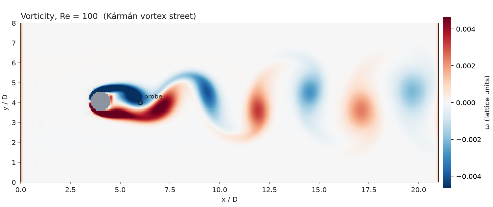
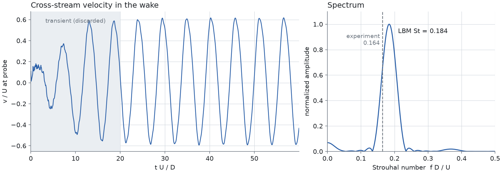
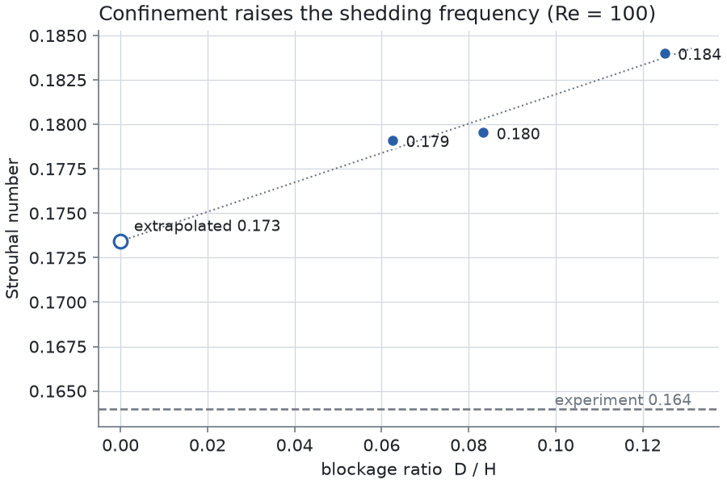

# Vortex shedding behind a cylinder at Re = 100 (Lattice Boltzmann)

A D2Q9 Lattice Boltzmann (BGK) solver in plain NumPy that simulates 2D flow past a
circular cylinder at Re = 100, records the wake, and measures the shedding frequency
as a Strouhal number St = f D / U. The result is compared with the experimental value
St ≈ 0.164 (Williamson, 1996).



## How to run

```bash
pip install -r requirements.txt
python test_lbm.py                                  # sanity checks (~5 s)
python cylinder_lbm.py --re 100 --steps 30000       # ~6 min -> results/run_re100.npz
python analyze.py results/run_re100.npz             # St + plots
```

Options: `--re`, `--steps`, `--nx`, `--ny`, `--D`, `--U`, `--kick`, `--out`.
Blockage study:

```bash
python cylinder_lbm.py --steps 20000 --ny 240 --out results/ny240
python cylinder_lbm.py --steps 20000 --ny 320 --out results/ny320
python compare_blockage.py results/run_re100.npz results/ny240/run_re100.npz results/ny320/run_re100.npz
```

## Setup (lattice units)

| Quantity | Value |
|---|---|
| Grid | 420 × 160 (baseline) |
| Cylinder | D = 20, center (80, 81): 1 cell off the centerline |
| Inlet velocity | U = 0.04 (Mach ≈ 0.07) |
| Viscosity | ν = U D / Re = 0.008, so τ = 0.524 |
| Probe | v-velocity at 2D behind the cylinder, on the centerline |
| Boundaries | Zou–He velocity inlet, zero-gradient outlet, periodic top/bottom, bounce-back cylinder |
| Start-up | a transverse velocity kick of 0.3 U in the near wake at t = 0 |

## Results



| Domain height H | D/H | St (LBM) | Error vs 0.164 |
|---|---|---|---|
| 160 (baseline) | 0.125 | **0.184** | +12.2% |
| 240 | 0.083 | 0.180 | +9.5% |
| 320 | 0.063 | 0.179 | +9.2% |
| Linear extrapolation to H → ∞ | 0 | 0.173 | +5.8% |

- The wake settles into clean periodic shedding by step ~8,000, with v/U ≈ ±0.6 at the
  probe. The period scatter is about 7 steps in a ~2,720-step period.
- The zero-crossing and FFT estimates agree to 4 significant figures (0.1840 vs 0.1841).
- The baseline St = 0.184 is outside the target band of 0.15–0.18 set at the start. The
  two taller domains land just inside it.



### Why St is high

1. **Confinement.** Periodic top and bottom boundaries make this an infinite column of
   cylinders, which speeds up the flow past each one. Doubling the domain height lowers
   St from 0.184 to 0.179. Fitting a straight line through three points is only a rough
   correction, and it still leaves about +6%.
2. **Not tested here:** coarse resolution (D = 20 cells, with a staircase cylinder
   surface from simple bounce-back), and the inlet only 4D upstream of the cylinder.
   These are the next things to check, with D = 40 and a longer upstream region.

### Practical notes

- Without the initial kick, a 1-cell offset alone takes more than 20,000 steps to grow
  noticeable shedding (v/U < 0.05 at step 20,000). With the kick, shedding is fully
  developed by step 8,000.
- Speed is about 12 ms per step for 420 × 160 on one CPU core.

## Files

| File | Purpose |
|---|---|
| `cylinder_lbm.py` | Solver; saves probe history and final velocity field (`.npz`) |
| `analyze.py` | Strouhal number (zero crossings + FFT), vorticity and spectrum plots |
| `compare_blockage.py` | St vs. D/H plot and extrapolation |
| `test_lbm.py` | Lattice identities, equilibrium moments, uniform flow with no cylinder |
| `results/` | `.npz` runs, `summary_*.json`, `blockage_study.json`, figures |
